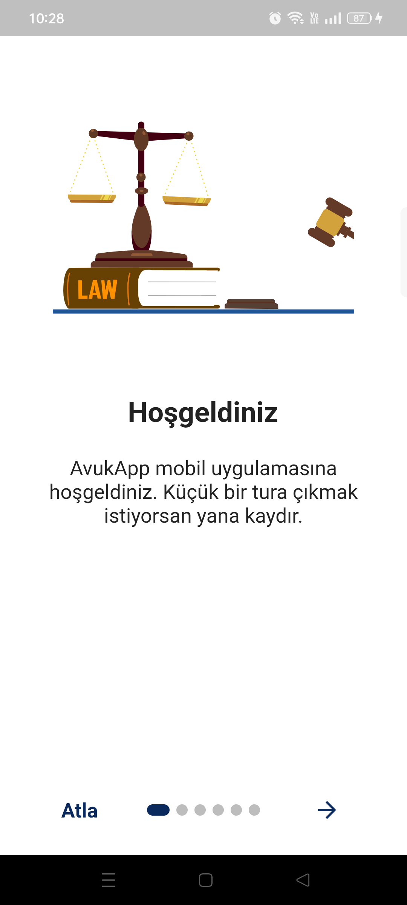
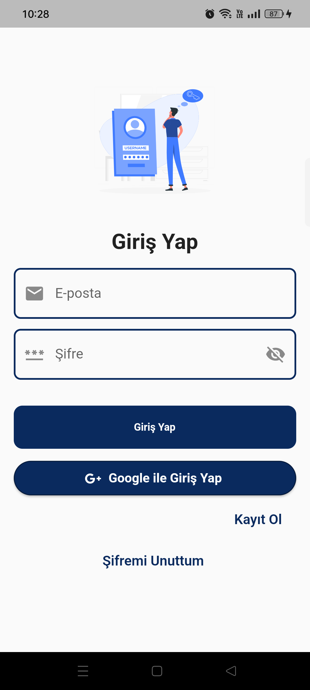
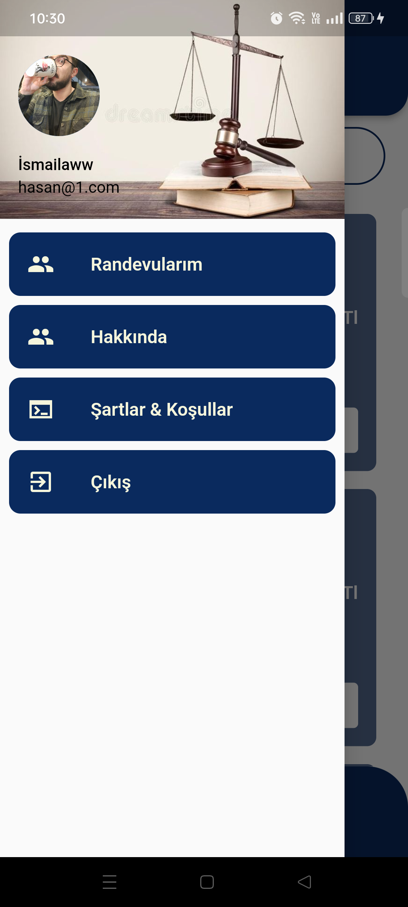
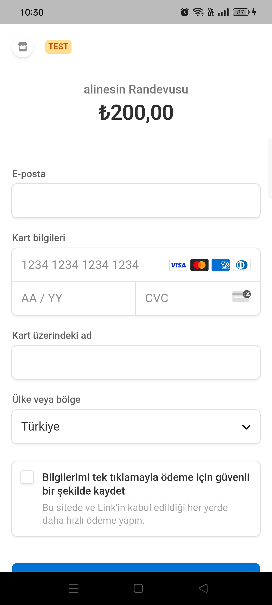
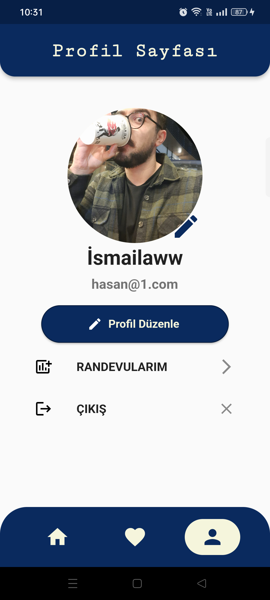
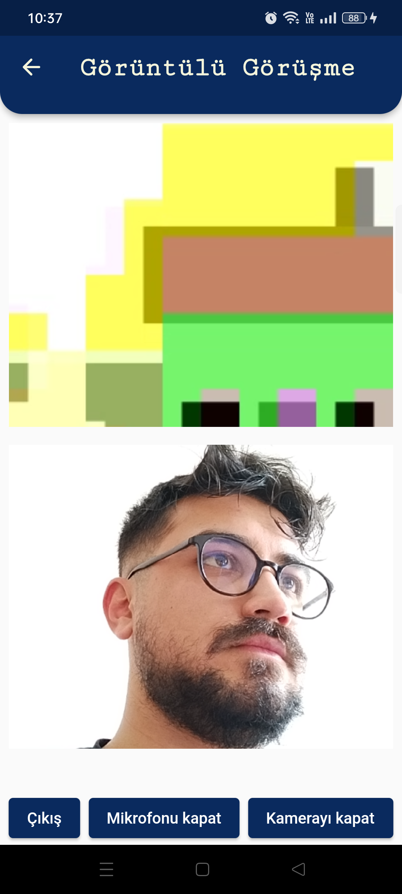

# avukapp

This project has been developed for the purpose of providing legal consultancy.

## Project Description

AvukApp is a platform that enables users to access legal consultancy services online. The project facilitates interaction between lawyers and users and offers solutions to legal issues.

## Features

Lawyer Membership: Lawyers can create profiles, showcase their services, and provide consultancy to users.
User Membership: Users can share their legal problems, search for lawyers, and receive consultancy.
Video Call: Enables video call functionality between lawyers and users through the platform.
Appointment Calendar: Users can schedule and manage appointments with lawyers using the calendar feature.

 | 
 | 
 |  
 | 
 | 
 | 